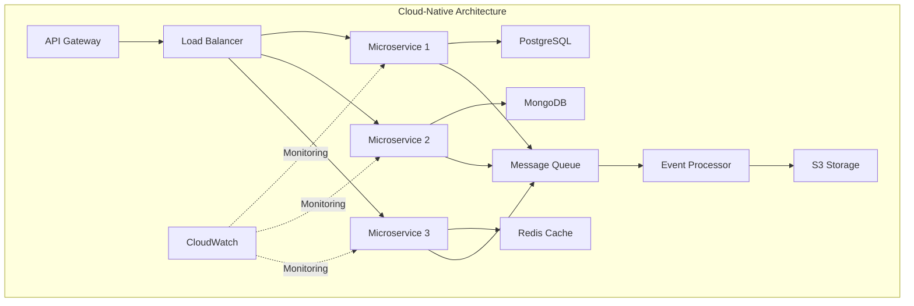

<div align="center">

# 👨‍💻 Daniel Morales
### Software Engineer | Cloud Solutions Architect


[](https://linkedin.com/in/tu-perfil)
[](mailto:tu-email@gmail.com)
[](https://tu-portfolio.com)

</div>

---

## 🎯 About Me

```yaml
name: Daniel Morales
role: Software Engineer & Cloud Architect
location: Remote
focus: 
  - Cloud-Native Applications
  - Microservices Architecture
  - DevOps & Infrastructure as Code
  - Distributed Systems
philosophy: "Building scalable, resilient, and efficient cloud solutions"
```

🚀 Passionate **Software Engineer** specializing in **Cloud Computing** and **Distributed Systems**. I design and implement enterprise-grade solutions leveraging modern cloud architectures, microservices patterns, and DevOps best practices.

### What I Do Best:
- 🏗️ **Cloud Architecture**: Design multi-tier, scalable cloud solutions on AWS & GCP
- 🔄 **CI/CD Automation**: Build robust deployment pipelines with infrastructure as code
- 🐳 **Container Orchestration**: Deploy and manage containerized applications at scale
- 📊 **System Design**: Create high-performance, fault-tolerant distributed systems
- ⚡ **Performance Optimization**: Profile, monitor, and optimize cloud infrastructure costs

---

## 📊 GitHub Analytics

<div align="center">
  
  
</div>

<div align="center">
  
  
</div>

---

## 🏗️ Cloud & Software Engineering Stack

<div align="center">

### ☁️ Cloud Platforms & Services


**AWS Services:**  


**GCP Services:**  


### 🐳 DevOps & Infrastructure


### 📊 Monitoring & Observability


### 💻 Programming Languages


### 🔧 Frameworks & Technologies

**Backend:**  


**Frontend:**  


### 🗄️ Databases & Message Queues


</div>

---

## 🏛️ Architecture & Design Patterns



### ✨ Core Competencies:
- **Microservices Architecture** - Domain-driven design, service mesh, API gateways
- **Serverless Computing** - AWS Lambda, Cloud Functions, event-driven architectures
- **Container Orchestration** - Kubernetes, Docker Swarm, ECS/EKS
- **Infrastructure as Code** - Terraform, CloudFormation, Pulumi
- **CI/CD Pipelines** - GitHub Actions, Jenkins, GitLab CI, ArgoCD
- **Cloud Security** - IAM, VPC, Security Groups, Secrets Management
- **Database Design** - SQL/NoSQL optimization, sharding, replication
- **Message-Driven Systems** - Kafka, RabbitMQ, Pub/Sub, SQS

---

## 🚀 Featured Projects

<div align="center">

### 🏢 Enterprise API Platform
**Cloud-Native Microservices Ecosystem**


```yaml
Architecture: Microservices with API Gateway
Infrastructure: AWS EKS + RDS + ElastiCache
Features: 
  - Auto-scaling based on traffic patterns
  - Multi-region deployment with failover
  - Real-time monitoring with Prometheus/Grafana
  - CI/CD with GitLab and ArgoCD
  - 99.9% uptime SLA
Performance: 10,000+ requests/second
```

---

### ☁️ Serverless Data Pipeline
**Real-Time Event Processing System**


```yaml
Architecture: Event-driven serverless
Stack: Cloud Functions + Pub/Sub + BigQuery
Scale: Processes 1M+ events/day
Features:
  - Real-time data ingestion and transformation
  - Automated schema validation
  - Cost-optimized with Cloud Scheduler
  - Terraform-managed infrastructure
Cost Reduction: 60% vs traditional VM-based approach
```

---

### 🐳 Multi-Cloud DevOps Platform
**Automated Deployment & Orchestration**


```yaml
Capabilities:
  - Multi-cloud deployment (AWS + GCP)
  - Infrastructure as Code with Terraform
  - Automated testing & security scanning
  - Blue-green & canary deployments
  - Centralized logging with ELK stack
Impact: Reduced deployment time from 4 hours to 15 minutes
```

</div>

---

## 📈 Cloud Cost Optimization Achievements

<div align="center">

| Metric | Before | After | Improvement |
|--------|--------|-------|-------------|
| 💰 Monthly Cloud Spend | $12,000 | $6,500 | **-46%** |
| ⚡ API Response Time | 850ms | 220ms | **-74%** |
| 📊 Database Query Time | 1.2s | 180ms | **-85%** |
| 🔄 Deployment Frequency | Weekly | Daily | **+600%** |
| 🐛 Production Incidents | 12/month | 2/month | **-83%** |

</div>

---

## 🎓 Certifications & Learning

<div align="center">


</div>

```typescript
const continuousLearning = {
  currentFocus: [
    "Advanced Kubernetes Patterns",
    "Site Reliability Engineering (SRE)",
    "Cloud Security & Compliance",
    "FinOps & Cloud Cost Management"
  ],
  nextCertifications: [
    "AWS Certified DevOps Engineer - Professional",
    "Certified Kubernetes Administrator (CKA)",
    "HashiCorp Certified: Terraform Associate"
  ]
};
```

---

## 📊 Contribution Graph

<div align="center">
  
</div>

---

## 🐍 Coding Activity

<div align="center">
  
</div>

---

## 🎧 Currently Listening To

<div align="center">
  <a href="https://open.spotify.com/user/31cu4qobkw4tsmuztburminbutlq">
    
  </a>
</div>

---

## 📝 Latest Technical Articles

<div align="center">
  
</div>

---

## 📫 Let's Connect

<div align="center">

[](https://linkedin.com/in/tu-perfil)
[](mailto:tu-email@gmail.com)
[](https://wa.me/tu-numero)
[](https://tu-portfolio.com)

</div>

---

## 💬 Ask Me About

```go
package main

import "fmt"

type Expertise struct {
    CloudArchitecture   []string
    Microservices      []string
    DevOps             []string
    BestPractices      []string
}

func main() {
    expertise := Expertise{
        CloudArchitecture: []string{
            "Multi-cloud strategies",
            "Serverless architectures",
            "Cost optimization techniques",
            "High availability & disaster recovery",
        },
        Microservices: []string{
            "Service mesh implementation",
            "API gateway patterns",
            "Event-driven architecture",
            "Domain-driven design",
        },
        DevOps: []string{
            "CI/CD pipeline automation",
            "Infrastructure as Code",
            "Container orchestration",
            "Monitoring & observability",
        },
        BestPractices: []string{
            "Clean code principles",
            "SOLID & design patterns",
            "Security best practices",
            "Performance optimization",
        },
    }
    
    fmt.Println("Let's build something amazing together! 🚀")
}
```

---

## 📊 Profile Stats

<div align="center">
  
</div>

<div align="center">
  
</div>

---

<div align="center">
  
**"The best way to predict the future is to invent it."** - Alan Kay

⭐ From [dani6777-2](https://github.com/dani6777-2) with 💙 and ☕

</div>